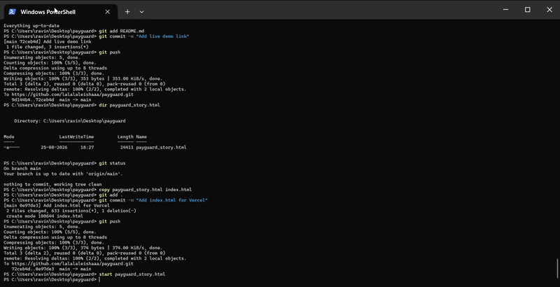

# PayGuard - AI Revenue Recovery Agent


## Live Demo

🔗 [View Live Demo](https://payguard-gules.vercel.app/)

## Overview

PayGuard is an AI-powered revenue recovery agent built for Razorpay that automatically detects failed transactions, diagnoses root causes using LLM intelligence, and executes recovery actions to convert lost revenue into recovered payments.

## Problem Statement

Indian businesses lose INR 15,000+ crores annually to failed payments. Traditional systems simply log the error and require manual intervention. This leads to:
- Revenue leakage from recoverable failures
- Poor customer experience
- High operational costs for support teams
- No systematic recovery process

## Solution

PayGuard automatically:
1. **Detects** failed transactions in real-time
2. **Diagnoses** root cause using Claude LLM
3. **Recovers** revenue through intelligent actions
4. **Logs** every decision for complete auditability

## How It Works

1. **Transaction Fails** → Customer's payment fails with error code
2. **Detection** → PayGuard scans database for failed transactions
3. **Diagnosis** → Claude LLM analyzes error + customer context
4. **Fallback** → Rule-based classifier takes over if LLM unavailable
5. **Recovery** → Agent executes optimal action (retry/switch/reminder)
6. **Audit** → Every decision logged with reasoning and confidence

## Results

| Metric | Value |
|--------|-------|
| Failed transactions processed | 23 |
| Successfully recovered | 12 |
| Recovery rate | 55.1% |
| Revenue recovered | INR 226,093.01 |
| Average recovery time | < 5 seconds |
| Fallback triggered | 0 times |


## Demo



## Architecture

```text
+-------------+     +-------------+     +-------------+
|  Detection  |---->|  Diagnosis  |---->|  Recovery   |
|             |     |             |     |             |
|  Scan DB    |     |  LLM Call   |     |  Execute    |
|  for failed |     |  + Fallback |     |  Action     |
|  txns       |     |  rules      |     |             |
+-------------+     +-------------+     +-------------+
       |                   |                   |
       +-------------------+-------------------+
                           |
                           v
                +-------------------+
                |   Audit Trail     |
                |  Every decision   |
                |  is logged with   |
                |  reasoning        |
                +-------------------+
```

## Recovery Actions

| Action | Description | When Used |
|--------|-------------|-----------|
| `retry_now` | Immediate retry | Network errors, OTP expiry |
| `retry_later` | Delayed retry | Bank maintenance windows |
| `switch_method` | Suggest alternative payment | Card declined, insufficient funds |
| `send_reminder` | Personalized follow-up | High-value customers |
| `do_not_recover` | Skip recovery | Unrecoverable errors |

## Fallback System

When LLM is unavailable, a rule-based classifier handles common patterns:

| Error Code | Action | Confidence |
|-----------|--------|-----------|
| `upi_timeout` | retry_now | 0.85 |
| `card_declined` | switch_method | 0.70 |
| `otp_expired` | retry_now | 0.65 |
| High-value + any error | send_reminder | 0.75 |
| Unknown | do_not_recover | 0.30 |

## Safety Constraints

- Maximum 2 recovery attempts per transaction
- High-value threshold: INR 5,000+ gets extra attention
- Exponential backoff for LLM retries (2s, 4s, 8s)
- Complete audit trail for every action

## Testing

```text
11 passed in 0.15s

test_database_connection PASSED
test_failed_transactions_exist PASSED
test_customers_exist PASSED
test_recovery_actions_logged PASSED
test_audit_log_exists PASSED
test_fallback_network_issue PASSED
test_fallback_insufficient_funds PASSED
test_fallback_high_value PASSED
test_fallback_authentication PASSED
test_fallback_default PASSED
test_config_values PASSED
```


## Production Integration

PayGuard includes a Razorpay webhook handler (`webhook.py`) that:
- Verifies webhook signatures using HMAC-SHA256
- Extracts payment details from Razorpay webhook payload
- Triggers recovery agent for failed payments
- Logs everything to audit trail
- Includes health check endpoint

## Tech Stack

- **Backend**: Python, FastAPI
- **AI/LLM**: Claude (via OpenRouter)
- **Database**: SQLite
- **Testing**: pytest (11 tests)
- **Demo**: HTML/CSS/JS scroll-story

## API Endpoints

| Endpoint | Method | Description |
|----------|--------|-------------|
| `/` | GET | Dashboard |
| `/api/metrics` | GET | Recovery metrics |
| `/api/recent-actions` | GET | Recent recovery actions |
| `/razorpay-webhook` | POST | Webhook handler |
| `/health` | GET | Health check |

## Design Decisions

- **Why LLM + Fallback?** LLM provides intelligence, fallback ensures reliability
- **Why SQLite?** Zero-config, perfect for demo, easy to swap for PostgreSQL
- **Why OpenRouter?** Access to Claude without managing API credits
- **Why 2 max retries?** Prevents customer harassment and API abuse
- **Why audit everything?** Fintech requires complete traceability

## Setup Instructions

### Prerequisites
- Python 3.8+
- OpenRouter API key (or Anthropic API key)

### Installation

```bash
git clone https://github.com/lalalaleishaaa/payguard.git
cd payguard
python -m venv venv
source venv/bin/activate  # Windows: venv\Scripts\activate
pip install -r requirements.txt

## Project Structure

payguard/
├── .github/
│ └── workflows/
│ └── tests.yml # CI/CD pipeline
├── agent.py # Recovery agent (core logic)
├── app.py # FastAPI backend
├── webhook.py # Razorpay webhook handler
├── config.py # Configuration settings
├── data_generator.py # Synthetic data generator
├── database.py # Database layer
├── fallback.py # Rule-based fallback classifier
├── llm_client.py # LLM API wrapper
├── payguard_story.html # Scroll-story demo
├── index.html # Vercel entry point
├── demo.gif # Demo animation
├── requirements.txt # Dependencies
├── README.md
├── LICENSE
├── vercel.json # Vercel config
├── templates/
│ └── dashboard.html # Dashboard template
└── tests/
└── test_agent.py # 11 tests


## Future Improvements

- Razorpay webhook integration for real-time processing
- ML-based success probability prediction
- A/B testing for recovery strategies
- Multi-currency support
- Email/SMS integration for reminders
- PostgreSQL migration for production scale
- Docker containerization

## License

MIT
